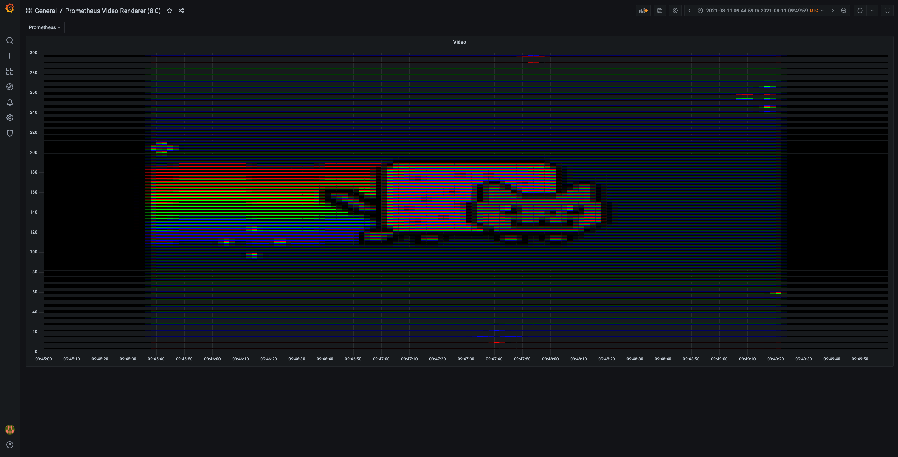
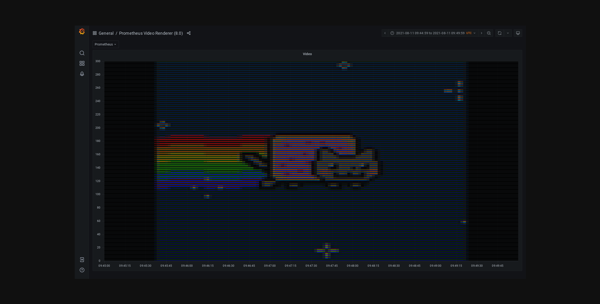

# Prometheus video renderer

## What we'll do

Render videos in Grafana through Prometheus metrics.  
[MacroPower/prometheus_video_renderer](https://github.com/MacroPower/prometheus_video_renderer)

## How we do it

### Install dependencies

```sh
brew install golang ffmpeg jsonnet-bundler
```

```sh
cat <<EOF >> ~/.zshrc 
# go
export GOPATH=$HOME/go
export GOBIN=$HOME/go/bin
export PATH=$PATH:$GOBIN
EOF

source ~/.zshrc 
```

```sh
go get github.com/bwplotka/bingo
```

### Setup project

```sh
git clone git@github.com:MacroPower/prometheus_video_renderer.git
cd prometheus_video_renderer

bingo get -v
(cd grafana; jb install)

mkdir data

docker compose up
```

```sh
make dashboards
```

### Convert video to metrics

We'll be using [Nyan Cat original video](https://www.youtube.com/watch?v=QH2-TGUlwu4) for obvious reasons. Go ahead and download, name it `nyan_cat.mp4` and place the file in the project folder.

```sh
mkdir -p frames/nyan_cat
ffmpeg -i 'nyan_cat.mp4' -vf 'scale=150:100' -vsync 0 'frames/nyan_cat/out%06d.png'

mkdir -p metrics/nyan_cat
ulimit -n 8192
prometheus_video_renderer --project nyan_cat --mode rgb --start-time 1628640000000 # 11-08-2021 00:00:00
```

### Backfill metrics into Prometheus

```sh
scripts/load.sh nyan_cat
```

### Visualize output

Go to [http://localhost:3000/d/pvr-dash-8-rgb/prometheus-video-renderer-8-0?orgId=1&from=1628675100000&to=1628675400000](http://localhost:3000/d/pvr-dash-8-rgb/prometheus-video-renderer-8-0?orgId=1&from=1628675100000&to=1628675400000)


Go to [http://localhost:8081/render?deviceScaleFactor=1.000000&domain=localhost&encoding=&height=1080&renderKey=TljYdA5Bp7IEU7D7rasBnwc6my7mu5hW&timeout=59&timezone=&url=http://grafana:3000/d/pvr-dash-8-rgb?from%3D1628675100000%26height%3D1080%26timeout%3D59%26to%3D1628675400000%26width%3D1920%26render%3D1&width=1920](http://localhost:8081/render?deviceScaleFactor=1.000000&domain=localhost&encoding=&height=1080&renderKey=TljYdA5Bp7IEU7D7rasBnwc6my7mu5hW&timeout=59&timezone=&url=http://grafana:3000/d/pvr-dash-8-rgb?from%3D1628675100000%26height%3D1080%26timeout%3D59%26to%3D1628675400000%26width%3D1920%26render%3D1&width=1920)


### Render frames through Grafana

```sh
mkdir -p frames/nyan_cat/rendered/video

grafana-image-renderer-cli sequence \
    --api-url=http://localhost:3000 \
    --api-key-or-basic-auth=admin:admin \
    --dashboard=pvr-dash-8-rgb \
    --start-time=1628675099640 \
    --frame-interval=5m \
    --out-directory=frames/nyan_cat/rendered \
    --frames=1-500
```

### Merge everything back into a video

Now trim your original video to the portion of the video rendered if needed so that the audio can be merged with output. 

```sh
cd frames/nyan_cat/rendered

ffmpeg -framerate 30 -i '%06d.png' \
    -i ../../../nyan_cat_trimmed.mp4 -c copy -map 0:0 -map 1:1 -c:v libx264rgb -pix_fmt rgb24 -preset veryslow -crf 0 -qp 0 \
    video/grafanyan_cat.mp4
```

Open `video/grafanyan_cat.mp4` and enjoy ^_^

Example output:
<p>
  <iframe width="560" height="315" src="https://www.youtube.com/embed/vvJUK9HOKQU" title="YouTube video player" frameborder="0" allow="accelerometer; autoplay; clipboard-write; encrypted-media; gyroscope; picture-in-picture" allowfullscreen></iframe>
</p>

## Resources

- [https://grafana.com/blog/2021/07/30/how-to-use-grafana-and-prometheus-to-rickroll-your-friends-or-enemies/](https://grafana.com/blog/2021/07/30/how-to-use-grafana-and-prometheus-to-rickroll-your-friends-or-enemies/)
- [https://giedrius.blog/2019/09/21/is-it-a-good-idea-to-use-prometheus-for-storing-ascii-paintings/](https://giedrius.blog/2019/09/21/is-it-a-good-idea-to-use-prometheus-for-storing-ascii-paintings/)
- [https://github.com/MacroPower/grafana-image-renderer-sdk-go](https://github.com/MacroPower/grafana-image-renderer-sdk-go)
- [https://github.com/grafana/grafana-image-renderer](https://github.com/grafana/grafana-image-renderer)
